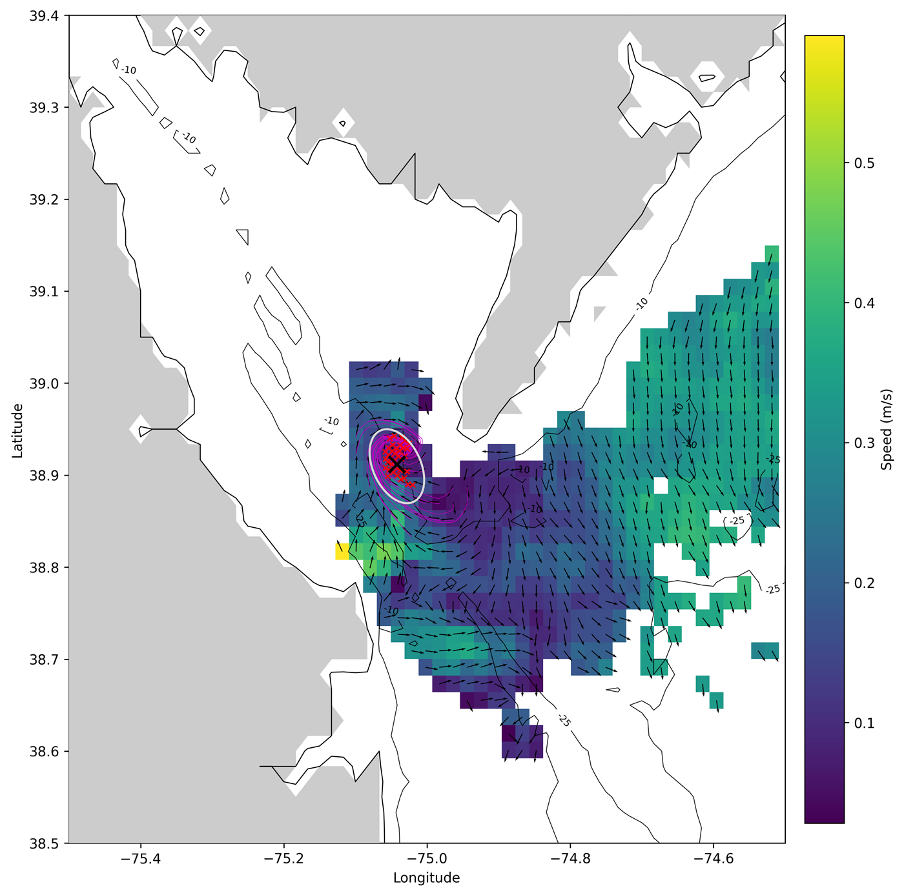
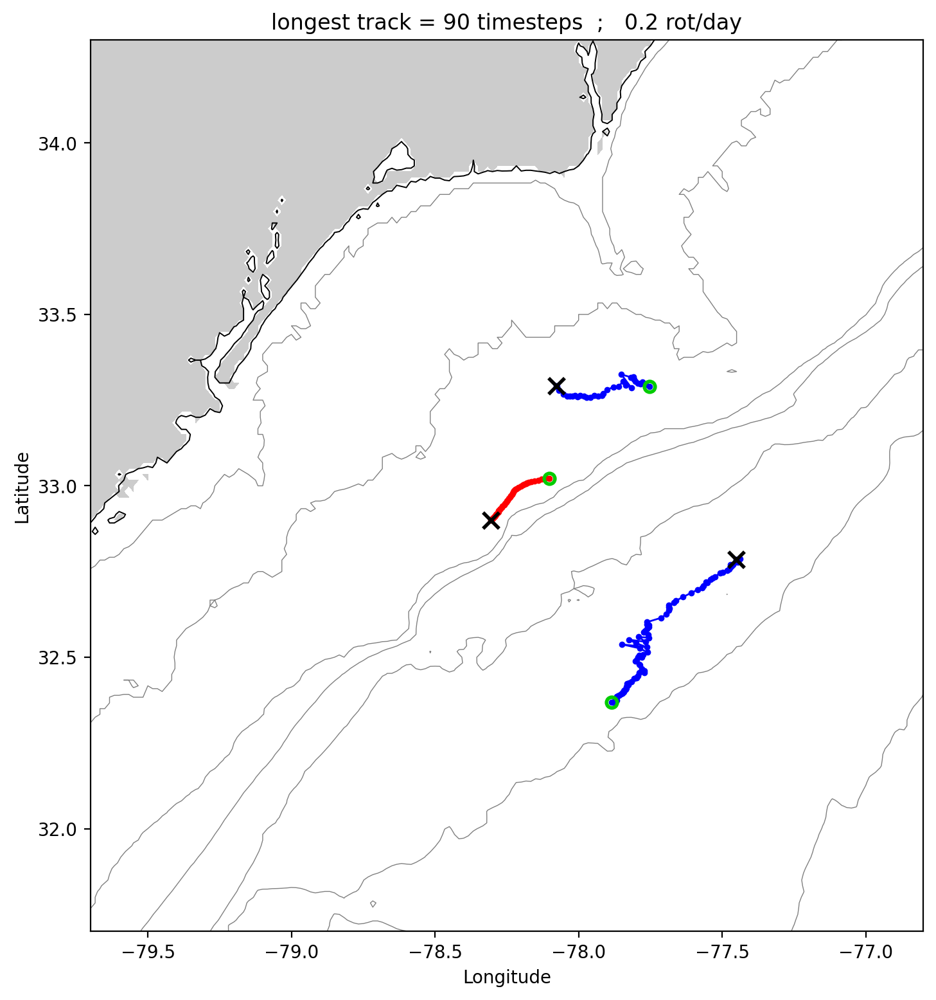

# eddy_identification_winding

Eddy identification and tracking for HF radar surface current data using the
Winding Angle method, with the Cahl et al. (2023) streamline clustering.
Douglas Cahl, PhD — University of South Carolina.

The toolbox is Python-first (this folder); the original MATLAB code lives in
[`matlab/`](matlab/) and produces the same results (see the report below —
agreement is at machine precision).

## Quick start (Python)

Requires Python 3.10+ with `numpy`, `scipy`, `matplotlib`, `netCDF4`;
`numba` is optional but strongly recommended (~40× faster hot loops,
bit-identical results).

```
python eddy_uvdata.py        # single netcdf file example (Delaware Bay sample)
python eddy_uvdata_loop.py   # identify eddies in all 101 timesteps of data/data2.nc
python eddy_tracking.py      # link identifications into tracks
python analyze_eddy_tracks.py  # track map + statistics figures
```

Both example datasets ship in [`data/`](data/). Results are written to
`data/results/` (NetCDF) and figures to `data/results_figs/`.

For bathymetry and coastline in the figures, put the ETOPO1 binary
`etopo1_ice_g_i2.bin` in `etopo1/` or `m_map/etopo1/` (the same file m_map
uses); without it, figures simply skip those layers.

## Files

- `eddy_uvdata.py` — single-file example driver (your own lon/lat/u/v data or a netcdf file)
- `eddy_uvdata_loop.py` — multi-timestep identification, parallel over CPU cores
- `eddy_tracking.py` — eddy tracking with the Cahl 2023 ellipse/inpolygon continuation test
- `analyze_eddy_tracks.py` — track map + histogram statistics
- `eddy_subroutine.py` — winding angle, clustering, ellipse fit, plotting, save
- `stream2_dc.py` / `kernels_numba.py` — streamline integrator (numba-compiled, pure-Python fallback)
- `utm_dc.py` — UTM conversions (`geog2utm_nodisp` / `utm2ll` ports)
- `etopo1_reader.py` — ETOPO1 subregion reader for bathymetry/coastline
- `results_io.py` — native NetCDF read/write for results and tracks
- `convert_data.py` — import MATLAB `.mat` data/results to the `.nc` schema
- `verify_vs_matlab.py` — file-by-file comparison of a Python run vs a MATLAB run
- `test_fast_omega.py` — A/B test for the `fast_omega` option

## MATLAB

The original MATLAB toolbox is in [`matlab/`](matlab/) — see its README.
Run it from the repo root (`addpath('matlab')`) so the relative `data/`
paths resolve. It requires m_map with the etopo1 and GSHHS data files.

## Data formats — NetCDF

The Python pipeline reads and writes only NetCDF; no `.mat` files are needed.

- Input: `data/data2.nc` (or any lon/lat/u/v/time source). Convert a MATLAB
  `data2.mat` with `python convert_data.py data`.
- Results: per-timestep `data2_<i>.nc` and `data2_tracks.nc` — per-eddy
  variables plus ragged streamline/track series as concatenated arrays with
  `*_start`/`*_len` index vectors.
- Time is CF-style `days since 1970-01-01`, with the exact original MATLAB
  datenum kept in `matlab_datenum`.

More information at http://douglascahl.com/eddy/

---

# Validation & performance report

The Python port was validated against the MATLAB code on both bundled
examples. A styled single-page version of this report is in
[`docs/report.html`](docs/report.html).

## Algorithm features (the current MATLAB code's upgrades, all ported)

- **Cahl et al. 2023 clustering (`inpolygon`).** Instead of merging winding
  streamlines by a fixed center distance (Sadarjoen & Post 2000), each
  streamline is treated as a closed polygon: two streamlines belong to the
  same eddy when one's center lies inside the other's polygon, or the
  polygons overlap in more than one point, with a resolution-scaled
  center-distance fallback (2√2 × grid resolution). Nested/concentric
  streamlines cluster correctly at any eddy size. Switchable via
  `new_dist_thres` (0 = old method).
- **`stream2_dc` integrator.** Inverse-distance-weighted 4-node velocity,
  Euler steps of 0.2 cell up to 2000 vertices, no visited-cell bookkeeping —
  circling streamlines keep winding, which is what allows the strict
  thresholds (winding > 300°, closure < 10 km).
- **Consistent UTM zone handling** through streamline, center, and ellipse
  conversions (`geog2utm_nodisp` / `utm2ll`, exact constant-for-constant ports).
- **√(2λ) ellipse axes** (proper standard-deviational ellipse).
- **Per-streamline lat/lon saved** with the results (`save_streams`).
- **Map figures** with the current-speed field, unit-vector quiver, labeled
  ETOPO1 bathymetry contours, and land/coastline.
- **Eddy tracking** with the ellipse-containment continuation test and
  gap-bridging (`eddy_track_time_param`), plus track statistics/plots.

## Validation 1 — single file (Delaware Bay, 2 km, 2020-04-03 09:00)

`data/202004030900_hfr_usegc_2km_rtv_uwls_NDBC.nc`, subregion 38.5–39.4°N /
75.5–74.5°W, winding > 300°, closure < 10 km, Cahl 2023 clustering:

| Quantity | MATLAB | Python |
|---|---|---|
| Eddies / streamlines | 1 / 36 | 1 / 36 |
| Center | 38.91159736°N, 75.04199806°W | identical |
| Rotation | −1 (CW / anticyclonic) | identical |
| Ellipse semi-axes | 2.88723389 × 4.74329731 km | identical (≥ 7 decimals) |
| Ellipse angle | −154.7562690° | identical (≥ 7 decimals) |



## Validation 2 — full tracking pipeline (data2: Long Bay, 3 km WERA, 101 half-hour timesteps)

| Quantity | MATLAB | Python |
|---|---|---|
| Eddies identified | 191 | 191 (zero count mismatches in 101 timesteps) |
| Max eddies in one timestep | 5 | 5 |
| Max streamlines in one eddy | 162 | 162 |
| Eddy centers | — | max difference 10⁻¹³ degrees (float64 rounding) |
| Ellipse axes / angle | — | within 10⁻¹² km / 4×10⁻¹¹ degrees |
| Tracks | 17 | 17 |
| Track lengths (timesteps) | 90, 44, 33, 5, 4, 3, 2, ten 1s | identical |

(`verify_vs_matlab.py` performs this comparison file-by-file.)

| MATLAB tracks | Python tracks |
|---|---|
|  |  |

The only difference found anywhere is the angular-velocity diagnostic ω:
MATLAB's `scatteredInterpolant` extrapolates outside the data hull while
scipy's `griddata` returns NaN (≤ 10⁻³ deg/s differences, a few extra NaNs).
Detection, positions, shapes, and tracking are unaffected.

## Performance

The hot loops (streamline integration, winding scan) are numba-compiled
(`kernels_numba.py`, LLVM, strict IEEE — **bit-identical** to the pure-Python
fallbacks used when numba is absent). The ω diagnostic is interpolated on one
whole-grid Delaunay triangulation per timestep (`fast_omega=1`, default)
instead of re-triangulating per streamline.

One data2 timestep (90×95 grid, ~2,380 valid points, single core):

| Implementation | Time |
|---|---|
| MATLAB R2024b (JIT) | ~10–27 s |
| Python, pure | ~395 s |
| + numba kernels (bit-identical) | ~52 s |
| + `fast_omega` (ω diagnostic only) | **~1.5 s** |

End-to-end on the 101-timestep data2 example (14 cores):

| Stage | MATLAB (single core) | Python |
|---|---|---|
| Identification (101 timesteps) | ~36 min | **27.9 s** |
| Tracking | seconds | 2.4 s |
| Track analysis + figures | seconds | 1.3 s |
| **Total** | **~36 min** | **31.7 s** |

Single-file Delaware Bay example including the full map figure: ~3 s.

### fast_omega A/B (6 timesteps: 1, 25, 50, 61, 75, 101)

`test_fast_omega.py` runs both modes and compares every saved quantity:
detection geometry (eddy counts, centers, directions, streamline counts and
coordinates, ellipse fits) is **bit-identical** in all cases; only ω shifts —
up to ~10% relative on individual eddies but ≲ 10⁻⁴ deg/s absolute, smaller
than the MATLAB↔Python interpolant difference. Set `params['fast_omega'] = 0`
for per-window interpolation (~50 s/timestep) that matches the pure-Python
baseline bit-exactly.
