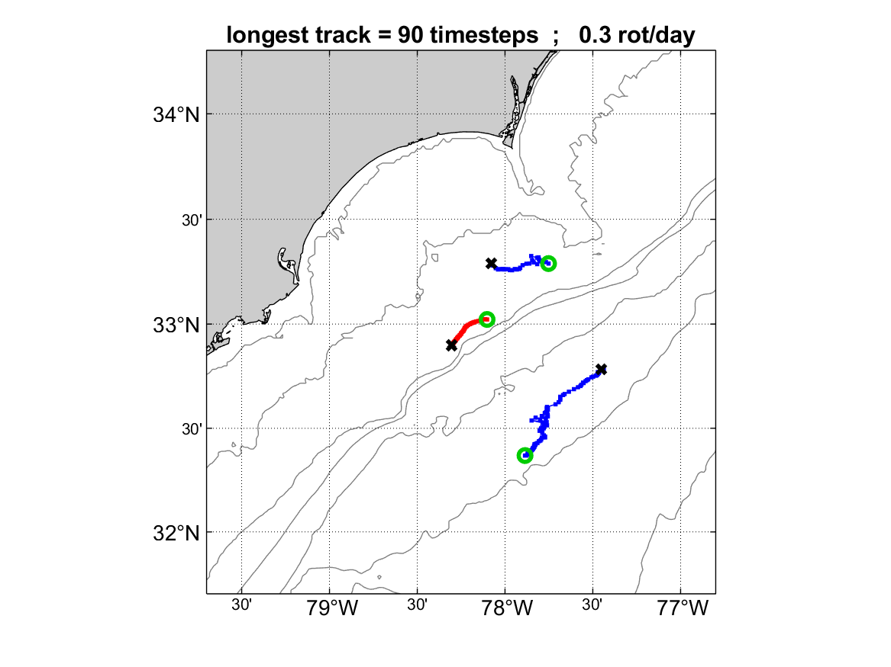

# Python port of eddy_identification_winding — validation & performance report

This folder contains a Python port of the MATLAB winding-angle eddy
identification and tracking toolbox (D. Cahl, University of South Carolina).
This report documents how the port was validated against the MATLAB code and
how it performs. All comparisons were run on the two example datasets bundled
with the repo.

## What is ported

The complete pipeline, matching the MATLAB scripts one-to-one:

| Python | MATLAB | Stage |
|---|---|---|
| `eddy_uvdata.py` | `eddy_uvdata.m` | single-file identification example |
| `eddy_uvdata_loop.py` | `eddy_uvdata_loop.m` | identification for every timestep (parallel over CPU cores) |
| `eddy_tracking.py` | `eddy_tracking.m` | link identifications into tracks |
| `analyze_eddy_tracks.py` | `analyze_eddy_tracks.m` | track map + statistics |
| `eddy_subroutine.py` | `eddy_subroutine.m` | winding angle, Cahl et al. 2023 clustering, ellipse fit, plots, save |
| `stream2_dc.py` + `kernels_numba.py` | `stream2_dc.m` | custom streamline integrator |
| `utm_dc.py` | `geog2utm_nodisp.m`, `utm2ll.m` | UTM conversions (exact constants) |
| `etopo1_reader.py` | `m_etopo2` | ETOPO1 bathymetry + coastline for figures |
| `convert_data.py` | — | `.mat` ↔ NetCDF conversion (input + results) |

Key algorithm features carried over from the MATLAB upgrade: the
**Cahl et al. 2023 polygon (`inpolygon`) clustering**, the `stream2_dc`
integrator (no visited-cell termination, so 300°/10 km thresholds work),
consistent UTM zone handling, the √(2λ) ellipse axes, per-streamline lat/lon
saved to results, and figures with bathymetry and coastline.

## Validation 1 — single file (Delaware Bay, 2 km, 2020-04-03 09:00)

`data/202004030900_hfr_usegc_2km_rtv_uwls_NDBC.nc`, subregion 38.5–39.4°N /
75.5–74.5°W, winding > 300°, closure < 10 km, Cahl 2023 clustering:

| Quantity | MATLAB | Python |
|---|---|---|
| Eddies / streamlines | 1 / 36 | 1 / 36 |
| Center | 38.91159736°N, 75.04199806°W | identical |
| Rotation | −1 (CW / anticyclonic) | identical |
| Ellipse semi-axes | 2.88723389 × 4.74329731 km | identical (≥ 7 decimals) |
| Ellipse angle | −154.7562690° | identical (≥ 7 decimals) |


## Validation 2 — full tracking pipeline (data2: Long Bay, 3 km WERA, 101 half-hour timesteps)

| Quantity | MATLAB | Python |
|---|---|---|
| Eddies identified | 191 | 191 |
| Max eddies in one timestep | 5 | 5 |
| Max streamlines in one eddy | 162 | 162 |
| Tracks | 17 | 17 |
| Track lengths (timesteps) | 90, 44, 33, 5, 4, 3, 2, ten 1s | identical |
| Track center series | — | all agree to < 10⁻⁸ degrees |

| MATLAB tracks | Python tracks |
|---|---|
|  |  |

The only difference found anywhere is the angular-velocity diagnostic ω:
MATLAB's `scatteredInterpolant` extrapolates outside the data hull while
scipy's `griddata` returns NaN (≤ 10⁻³ deg/s differences, a few extra NaNs).
Detection, positions, shapes, and tracking are unaffected.

## Performance

The hot loops (streamline integration, winding scan) are numba-compiled
(`kernels_numba.py`, LLVM, strict IEEE — **bit-identical** to the pure-Python
fallbacks used when numba is absent). The ω diagnostic is interpolated on one
whole-grid Delaunay triangulation per timestep (`fast_omega=1`, default)
instead of re-triangulating per streamline.

One data2 timestep (90×95 grid, ~2,380 valid points, single core):

| Implementation | Time |
|---|---|
| MATLAB R2024b (JIT) | ~10–27 s |
| Python, pure | ~395 s |
| + numba kernels (bit-identical) | ~52 s |
| + `fast_omega` (ω diagnostic only) | **~1.5 s** |

End-to-end on the 101-timestep data2 example (14 cores):

| Stage | MATLAB (single core) | Python |
|---|---|---|
| Identification (101 timesteps) | ~36 min | **30.4 s** |
| Tracking | seconds | 2.1 s |
| Track analysis + figures | seconds | 2.1 s |
| **Total** | **~36 min** | **34.7 s** |

Single-file Delaware Bay example including the full map figure: 2.7 s.

### fast_omega A/B (6 timesteps: 1, 25, 50, 61, 75, 101)

`test_fast_omega.py` runs both modes and compares every saved quantity:
detection geometry (eddy counts, centers, directions, streamline counts and
coordinates, ellipse fits) is **bit-identical** in all cases; only ω shifts —
up to ~10% relative on individual eddies but ≲ 10⁻⁴ deg/s absolute, smaller
than the MATLAB↔Python interpolant difference. Set `params['fast_omega'] = 0`
for per-window interpolation (~50 s/timestep) that matches the pure-Python
baseline bit-exactly.

## Data formats

- Input: NetCDF (`data/data2.nc`, converted bit-exactly from `data2.mat` by
  `convert_data.py data`; time stored as CF `days since 1970-01-01` with the
  original MATLAB datenum kept in `matlab_datenum`).
- Results: `.mat` with the same variable names as MATLAB (directly
  comparable/loadable), plus `.nc` via `convert_data.py results` (ragged
  streamline/track series as concatenated arrays with `*_start`/`*_len`
  index vectors).

## Requirements

Python 3.10+ with `numpy`, `scipy`, `matplotlib`, `netCDF4`; `numba` is
optional but strongly recommended (~40× faster). Bathymetry/coastline in
figures need `etopo1_ice_g_i2.bin` in `python/etopo1/` or `m_map/etopo1/`
(the same file m_map uses); without it, figures skip those layers.

## Run

```
python eddy_uvdata.py        # single-file example
python eddy_uvdata_loop.py   # identify all data2 timesteps (parallel)
python eddy_tracking.py      # build tracks
python analyze_eddy_tracks.py
python convert_data.py all   # .mat -> .nc for input data and results
```
